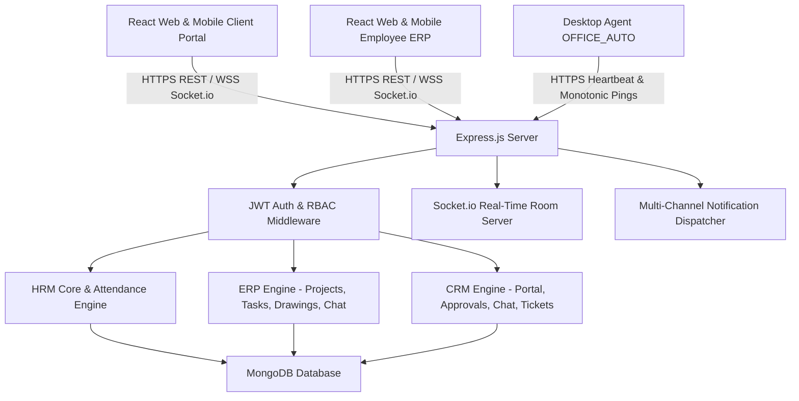

# Nirman Architects - Integrated ERP, CRM & HRM Master Specification & Operational Guide

Production-ready, enterprise-grade, integrated **ERP (Enterprise Resource Planning)**, **CRM (Client Relationship Management)**, and **HRM (Human Resource Management)** system built for **Nirman Architects** by **Nexalliance** (Client: Hirak bhai).

Stack: **Node.js + Express + MongoDB + Socket.io (Backend) | OpenAPI 3.0 Swagger UI**

---

## 📋 Table of Contents
1. [System Overview & Architecture](#-system-overview--architecture)
2. [Security, Auth & Identity (HRM Core)](#-security-auth--identity-hrm-core)
3. [Attendance Management System (Dual Mode)](#-attendance-management-system-dual-mode)
4. [Desktop Agent Setup (OFFICE_AUTO)](#-desktop-agent-setup-office_auto)
5. [HRM Operations (Leave, Payroll, Monitoring)](#-hrm-operations-leave-payroll-monitoring)
6. [CRM System (Modules 1 to 10)](#-crm-system-modules-1-to-10)
7. [ERP System (Modules 1 to 5)](#-erp-system-modules-1-to-5)
8. [Database Schemas Directory](#-database-schemas-directory)
9. [Complete 246 API Contract Directory](#-complete-246-api-contract-directory)
10. [Local Setup, Execution & Verification](#-local-setup-execution--verification)

---

## 🌟 System Overview & Architecture

Nirman Architects' backend is structured as a unified Node.js/Express monolith with MongoDB data storage and real-time Socket.io bi-directional messaging. It provides complete digital workflows for internal staff, project managers, lead architects, site engineers, studio directors, and external client contacts.

### Architecture Topology Diagram



---

## 🔐 Security, Auth & Identity (HRM Core)

### User Identity & Roles (`User` & `RoleMaster`)
The system manages dual user populations:
1. **Internal Employees (`User`)**: Authenticated via `/api/auth/login`. Roles defined in `RoleMaster`:
   - `SUPER_ADMIN` / `ADMIN`: Company-wide administrative access & override capabilities.
   - `PROJECT_MANAGER`: PM role for project creation, milestone management, task assignment, and internal review.
   - `LEAD_ARCHITECT` / `ARCHITECT` / `DESIGNER`: Design, drawing creation, version upload, task execution.
   - `SITE_ENGINEER`: Mobile GPS site attendance and on-site task reporting.
   - `EMPLOYEE`: General staff.
2. **Client Contacts (`ClientContact`)**: Authenticated via `/api/client-auth/login`. Permissions scoped per client contact:
   - `OWNER`: Full client portal privileges (drawing approval, chat, tickets, documents).
   - `MEMBER`: Interactive client privileges (chat, tickets, document view).
   - `VIEW_ONLY`: Read-only access to portal data.

---

## ⏱️ Attendance Management System (Dual Mode)

### Mode 1: `OFFICE_AUTO` (Desktop Automation)
- **Automatic Clock-In/Out**: Monitored by the Desktop Agent (`desktop-agent/agent.js`). PC boot and OS login automatically trigger Clock-In. Shutdown or OS logout triggers Clock-Out.
- **Hardware Device Binding**: Devices locked to registered hardware GUIDs (`Windows MachineGuid`). Unauthorized hardware attempts trigger `HTTP 403`, audit logging in `unauthorized_attempts`, and security notifications.
- **Heartbeat & Monotonic Clock**: Heartbeat ping sent every 2 minutes with monotonic tick checks to prevent system clock tampering.
- **Server Time Authority**: All final `clock_in_time` and `clock_out_time` timestamps use authoritative server time strictly.

### Mode 2: `SITE_MOBILE` (Mobile Geo-Fencing)
- **GPS Check-In/Out**: Mobile app sends latitude, longitude, and accuracy.
- **Haversine Geo-Fencing**: Server computes real-time distance against `SiteLocation` radius. Out-of-bounds check-in attempts are rejected or flagged with audit alerts.

---

## 💻 Desktop Agent Setup (OFFICE_AUTO)

The desktop agent runs as a background service on office workstations:

```bash
# 1. Navigate to desktop-agent directory
cd desktop-agent

# 2. Install agent dependencies
npm install

# 3. Configure environment in desktop-agent/.env
API_URL=http://localhost:5000/api
EMPLOYEE_EMAIL=staff@nirman.com
EMPLOYEE_PASSWORD=Password123!
HEARTBEAT_INTERVAL_MS=120000

# 4. Run Desktop Agent
node agent.js
```

---

## 📊 HRM Operations (Leave, Payroll, Monitoring)

1. **Leave Management (`LeaveMaster` & `LeaveBalance`)**:
   - Leave types (Casual, Sick, Earned, Unpaid).
   - Automated balance tracking per employee per year.
   - Multi-stage approval workflow (`Pending` -> `Approved` / `Rejected`).
2. **Payroll System (`Payroll`)**:
   - Monthly salary calculation incorporating attendance hours, overtime, leave deductions, allowances, and statutory deductions.
   - Automated payslip generation.
3. **Offer Letter Management (`OfferLetter`)**:
   - Template-based offer letter generation, candidate details, and approval workflow.
4. **Desktop Monitoring (`Screenshot` & `AppUsageDailySummary`)**:
   - Periodic desktop screenshot capture during office hours.
   - Active application tracking logging active time vs idle time to calculate daily productivity scores.

---

## 🤝 CRM System (Modules 1 to 10)

| Module | Title | Key Functionality |
| :--- | :--- | :--- |
| **CRM 1** | **Lead Management** | Pipeline stages (`New`, `Contacted`, `Proposal Sent`, `Converted`, `Closed`), lead assignment, conversion to Client. |
| **CRM 2** | **Client Master & Auth** | Client company profiles, multi-contact management (`OWNER`, `MEMBER`, `VIEW_ONLY`), client JWT authentication. |
| **CRM 3** | **Client-Project Linkage** | Security linkage (`ClientProjectLink`) binding clients to specific projects with visibility toggles (`visibleToClient: true`). |
| **CRM 4** | **Client Portal Core** | Client dashboard, project overview, status pipeline view, and milestone progress. |
| **CRM 5** | **Client Drawing Approval** | Client portal drawing review, approval/changes requested actions (`APPROVED`, `CHANGES_REQUESTED`), and audit log (`ClientApprovalLog`). |
| **CRM 6** | **Client Document Repository**| Secure client file repository access, category folders, and download history. |
| **CRM 7** | **Real-time Client Chat** | Socket.io real-time project chat (`project_<projectId>`), dual-author interleaving (`EMPLOYEE` + `CLIENT_CONTACT`), mentions, replies. |
| **CRM 8** | **Client Support & Ticketing**| Support query ticket creation (`ClientTicket`), priority, assignment, and status flow (`Open` -> `In Progress` -> `Resolved` -> `Closed`). |
| **CRM 9** | **Client CSAT Feedback** | CSAT survey ratings, satisfaction reviews, and feedback category analysis. |
| **CRM 10**| **Push Notification Dispatcher**| Multi-channel dispatcher supporting Email, In-App, and Desktop/Mobile Push notifications (FCM) based on client channel preferences. |

---

## 🏗️ ERP System (Modules 1 to 5)

### ERP Module 1: Project Management System
- **Project Entity**: Central project record (`projectId`, `projectName`, `projectCode`, `categoryId`, `departmentId`, `estimatedCompletion`).
- **Status Workflow**: `New` -> `Planning` -> `In Progress` -> `On Hold` -> `Completed` with full audit transition history (`ProjectStatusHistory`).
- **Milestone & Progress**: Automatic progress percentage computation from weighted completed milestones, PM manual override toggle (`progressIsManualOverride`).
- **Delay Detection**: Automated delay calculation (`isDelayed: true`) when current date exceeds `estimatedCompletion` for uncompleted projects.
- **Team & Responsibility Matrix**: Team assignments with custom project roles (`Lead Architect`, `Site Engineer`), responsibility matrix entries.
- **Progress Breakdown API**: `GET /api/projects/:id/progress-breakdown` aggregates overall progress, task breakdown (`taskWise`), employee performance (`employeeWise`), and drawing status (`drawingWise`).

### ERP Module 2: Task Management System
- **Task Unit of Work**: Task entity (`projectId`, `taskName`, `assignedEmployee`, `deadline`, `dependsOn`, `status`).
- **Workflow Pipeline**: `Pending` -> `Accepted` -> `In Progress` -> `Review` -> `Approved` -> `Completed`.
- **Dependency Hard Blocking**: Same-project task dependency check preventing a task from starting (`Pending` -> `In Progress`) if any dependent task (`dependsOn`) is uncompleted.
- **Reassignment & Audit**: Reassignment logging (`TaskReassignmentLog`), sub-checklists, task discussion comments (`TaskComment`), overdue task detection (`/tasks/overdue`).
- **HRM Time Analysis Correlation**: Correlates task execution timeframe (`actualStartTime` to `completionTime`) against HRM `AppUsageDailySummary` to compute exact idle time minutes and productivity scores (`productivityScore`).

### ERP Module 3: Drawing Management System
- **Multi-Version Control**: Parent `Drawing` and `DrawingVersion` schema enforcing the "never permanently replaced" rule (v1, v2, v3 auto-incrementing).
- **Dynamic Category Master**: Dynamic categories (`Concept Drawings`, `Working Drawings`, `Process DWG`, `GFC Drawings`, `Site`, `Interior`).
- **Two-Stage Internal Approval**: Internal review workflow (`DESIGNER_UPLOADED` -> `PM_APPROVED` -> `PENDING_CLIENT_APPROVAL`).
- **CRM 5 Handoff**: Admin review approval automatically sets `visibleToClient: true`, handing drawings off to the client portal.
- **GFC Lock & Process DWG Restrictions**: Promote drawing to locked GFC state (Super Admin unlock with logged reason); Process DWG in-place editing restrictions.
- **Breakdown API**: `GET /api/projects/:projectId/drawings/breakdown` populates drawing approval statistics.

### ERP Module 4: JPEG/3D Drawing Review
- **Interactive Viewer API Payload**: `GET /api/drawing-versions/:versionId/review-data` returns single aggregated payload with version metadata, comments, and markings.
- **Freehand & Shape Markings**: Support for `FREEHAND`, `RECTANGLE`, `CIRCLE`, `ARROW`, and `HIGHLIGHT_AREA` geometrical annotations (`DrawingMarking`).
- **Pinned Notes vs. General Comments**: Image coordinate-pinned **Notes** (`annotationCoords: {x, y}`) vs. general **Comments**.
- **Version Isolation**: Markings and notes isolated per `DrawingVersion` canvas.
- **Collaborative Review**: Shared data layer between internal employees and clients.

### ERP Module 5: Internal Project Chat
- **Unified Communication Workspace**: Team-scoped message threads with Admin company-wide oversight.
- **Contextual Cross-Linking**: Attach clickable task (`linkedTaskId`) or drawing version (`linkedDrawingVersionId`) references validated to belong to the same project.
- **Real-Time & Offline Sync**: Socket.io real-time room broadcasting (`project_<projectId>`), offline message batch sync (`POST /sync`).
- **Read Receipts & Badges**: Internal read status tracking (`EmployeeChatReadStatus`) powering unread badges (`GET /api/chat/unread-counts`).

### ERP Module 6: Document Management
- **Authoritative Document Repository**: Folder hierarchy (`DocumentFolder`), file type validation (`PDF`, `DWG`, `JPEG`, `PNG`, `DOCX`, `XLSX`, `ZIP`), multi-version revision history (`DocumentVersion`).
- **Automatic Client Visibility Reset**: Uploading a new version automatically resets `visibleToClient` to `false`, requiring explicit internal re-verification.
- **Client Portal Handoff & Audit Logging**: `visibleToClient: true` toggle immediately exposes document to CRM Module 6 client portal; internal and client `VIEW`/`DOWNLOAD` actions logged in `DocumentAccessLog`.

### ERP Module 7: Project Analysis & Dashboards
- **Project Dashboard Metrics**: Aggregated project progress %, completion %, delay status (`isDelayed`), overdue tasks, drawing approval rate, budget, and milestone timeline data.
- **Employee-Wise Analysis**: Per-employee task completion, working hours, average completion minutes, average productivity score (excluding `null` values), and HRM Attendance cross-referencing (office vs site days).
- **Task-Wise & Drawing-Wise Analysis**: Formatted, filterable task reporting view and drawing version approval status breakdown.
- **Department-Wise Progress**: Grouped task completion rates across internal departments.
- **Company-Wide Summary & Snapshot Caching**: Admin dashboard rollup across all active projects and `ProjectAnalyticsSnapshot` database caching layer.

---

## 🗄️ Database Schemas Directory

| Model File | Description & Primary Key / Key Fields |
| :--- | :--- |
| [User.js](file:///d:/NexAllince/Nirman-Architects/models/User.js) | Employees (`email`, `password`, `roleId`, `designation`, `department`, `boundDeviceId`) |
| [RoleMaster.js](file:///d:/NexAllince/Nirman-Architects/models/RoleMaster.js) | System roles (`roleName`, `roleCode`, `isActive`) |
| [Attendance.js](file:///d:/NexAllince/Nirman-Architects/models/Attendance.js) | Dual attendance (`userId`, `mode`, `clockInTime`, `clockOutTime`, `workDurationMinutes`, `isOffline`) |
| [SiteLocation.js](file:///d:/NexAllince/Nirman-Architects/models/SiteLocation.js) | Geo-fenced sites (`siteName`, `projectId`, `latitude`, `longitude`, `radiusMeters`) |
| [Project.js](file:///d:/NexAllince/Nirman-Architects/models/Project.js) | Projects (`projectName`, `status`, `progressPercentage`, `teamAssignments`, `estimatedCompletion`) |
| [ProjectCategory.js](file:///d:/NexAllince/Nirman-Architects/models/ProjectCategory.js) | Dynamic project categories (`name`, `isActive`) |
| [Department.js](file:///d:/NexAllince/Nirman-Architects/models/Department.js) | Department master (`name`, `code`, `isActive`) |
| [Task.js](file:///d:/NexAllince/Nirman-Architects/models/Task.js) | Tasks (`projectId`, `taskName`, `assignedEmployee`, `dependsOn`, `status`, `actualStartTime`, `completionTime`, `idleTimeMinutes`, `productivityScore`) |
| [TaskStatusHistory.js](file:///d:/NexAllince/Nirman-Architects/models/TaskStatusHistory.js) | Task status audit log (`taskId`, `fromStatus`, `toStatus`, `changedBy`, `notes`) |
| [TaskReassignmentLog.js](file:///d:/NexAllince/Nirman-Architects/models/TaskReassignmentLog.js) | Reassignment log (`taskId`, `fromEmployee`, `toEmployee`, `reassignedBy`) |
| [TaskComment.js](file:///d:/NexAllince/Nirman-Architects/models/TaskComment.js) | Task discussion comments (`taskId`, `authorId`, `commentText`) |
| [DrawingCategory.js](file:///d:/NexAllince/Nirman-Architects/models/DrawingCategory.js) | Dynamic drawing categories (`name`, `requiresClientApproval`, `restrictedEditing`) |
| [Drawing.js](file:///d:/NexAllince/Nirman-Architects/models/Drawing.js) | Parent drawing (`projectId`, `drawingName`, `categoryId`, `currentVersionId`, `isGFCLocked`, `visibleToClient`) |
| [DrawingVersion.js](file:///d:/NexAllince/Nirman-Architects/models/DrawingVersion.js) | Multi-version history (`drawingId`, `versionNumber`, `filePath`, `fileType`, `status`, `visibleToClient`, `changeLog`) |
| [DrawingVersionStatusHistory.js](file:///d:/NexAllince/Nirman-Architects/models/DrawingVersionStatusHistory.js) | Drawing status audit log (`drawingVersionId`, `fromStatus`, `toStatus`, `changedBy`) |
| [DrawingMarking.js](file:///d:/NexAllince/Nirman-Architects/models/DrawingMarking.js) | 3D render markings (`drawingVersionId`, `authorType`, `authorId`, `markingType`, `geometry`, `color`) |
| [DrawingComment.js](file:///d:/NexAllince/Nirman-Architects/models/DrawingComment.js) | Shared comments & pinned notes (`drawingId`, `drawingVersionId`, `authorType`, `authorId`, `commentText`, `annotationCoords`) |
| [ChatMessage.js](file:///d:/NexAllince/Nirman-Architects/models/ChatMessage.js) | Unified chat (`projectId`, `authorType`, `authorId`, `messageText`, `replyToMessageId`, `linkedTaskId`, `linkedDrawingVersionId`) |
| [EmployeeChatReadStatus.js](file:///d:/NexAllince/Nirman-Architects/models/EmployeeChatReadStatus.js) | Internal read receipts (`userId`, `projectId`, `lastReadMessageAt`) |
| [Client.js](file:///d:/NexAllince/Nirman-Architects/models/Client.js) | Client company (`name`, `companyName`, `phone`, `email`) |
| [ClientContact.js](file:///d:/NexAllince/Nirman-Architects/models/ClientContact.js) | Client portal user (`clientId`, `name`, `email`, `password`, `permissionLevel`) |
| [ClientProjectLink.js](file:///d:/NexAllince/Nirman-Architects/models/ClientProjectLink.js) | Security linkage (`clientId`, `projectId`, `visibleToClient`) |
| [ClientApprovalLog.js](file:///d:/NexAllince/Nirman-Architects/models/ClientApprovalLog.js) | Client drawing approval log (`drawingId`, `contactId`, `action`, `comments`) |
| [ClientTicket.js](file:///d:/NexAllince/Nirman-Architects/models/ClientTicket.js) | Client support tickets (`clientId`, `contactId`, `projectId`, `subject`, `status`) |
| [AppUsageDailySummary.js](file:///d:/NexAllince/Nirman-Architects/models/AppUsageDailySummary.js) | HRM daily app usage (`userId`, `date`, `activeTimeMinutes`, `idleTimeMinutes`, `productivityScore`) |

---

## 📜 Complete 246 API Contract Directory

All 246 active endpoints registered in the system:

```text
================================================================================
 Nirman Architects - API Master Endpoint Summary (246 Endpoints Total)
================================================================================
1.  GET /api/health                                -> System Health Check
2.  POST /api/auth/register                        -> Register Internal Employee
3.  POST /api/auth/login                           -> Employee Login & JWT Generation
4.  GET /api/roles                                 -> Get Role Master List
5.  POST /api/device/register                      -> Register Desktop Hardware GUID
6.  POST /api/attendance/office/event              -> Office Auto Clock-In / Clock-Out / Heartbeat
7.  POST /api/attendance/office/sync               -> Sync Offline Attendance Queue
8.  POST /api/attendance/site/checkin              -> Mobile Geo-Fenced Check-In
9.  POST /api/attendance/site/checkout             -> Mobile Geo-Fenced Check-Out
10. GET /api/attendance/all                        -> Company-Wide Attendance Records (HR View)
11. GET /api/attendance/project/:projectId         -> Team Attendance Split (Office vs Site)
12. POST /api/attendance/correction/request        -> Request Attendance Correction
13. POST /api/attendance/correction/approve        -> Approve Correction Request
14. POST /api/attendance/correction/reject         -> Reject Correction Request
15. GET /api/attendance/report                     -> Export Attendance Reports (PDF, Excel, CSV)
16. POST /api/site-locations                       -> Configure Project Geo-Fence Boundaries
17. GET /api/site-locations                        -> List Active Site Locations
18. GET /api/leave-type/active                     -> Active Leave Types
19. POST /api/leave-balance/assign                 -> Assign Initial Employee Leave Balances
20. GET /api/leave-balance/my                      -> Employee Personal Leave Balances
21. POST /api/leave/request                        -> Submit Leave Application
22. GET /api/leave/my                              -> Employee Personal Leave Applications History
23. GET /api/leave/pending                         -> Pending Leave Applications (HR/PM View)
24. PUT /api/leave/:id/approve                     -> Approve Leave Application
25. PUT /api/leave/:id/reject                      -> Reject Leave Application
26. POST /api/payroll/generate                     -> Generate Monthly Employee Payroll
27. GET /api/payroll/my                            -> Employee Payslip View
28. GET /api/payroll/all                           -> HR Payroll Management Overview
29. POST /api/offer-letter/create                  -> Generate Candidate Offer Letter
30. GET /api/offer-letter/:id                      -> Get Offer Letter Detail
31. PUT /api/offer-letter/:id/status               -> Update Offer Letter Status
32. POST /api/screenshot/upload                    -> Upload Desktop Monitoring Screenshot
33. GET /api/screenshot/employee/:userId           -> View Employee Screenshots (HR/Admin)
34. POST /api/app-usage/log                        -> Log Desktop Active/Idle Application Usage
35. GET /api/app-usage/daily-summary               -> Daily App Usage & Productivity Score Summary
36. POST /api/leads/create                         -> Create Lead Record
37. GET /api/leads                                 -> List Leads (Filter by Status/Owner)
38. GET /api/leads/:id                             -> Lead Details
39. PUT /api/leads/:id/status                      -> Update Lead Pipeline Status
40. POST /api/leads/:id/convert                    -> Convert Lead to Client Profile
41. POST /api/clients/create                       -> Create Client Company Profile
42. GET /api/clients                               -> List Client Companies
43. GET /api/clients/:id                           -> Client Profile Details
44. POST /api/clients/:id/contacts                 -> Add Contact to Client Profile
45. GET /api/clients/:id/contacts                  -> List Client Contacts
46. POST /api/client-auth/login                    -> Client Portal Contact Login
47. POST /api/client-project-links/create          -> Link Client to Project
48. GET /api/client-project-links/client/:clientId -> List Projects Linked to Client
49. PUT /api/client-project-links/:id/visibility   -> Toggle Client Portal Project Visibility
50. GET /api/client/projects                       -> Client Dashboard Linked Projects List
51. GET /api/client/projects/:id                   -> Client Project Overview & Milestones
52. GET /api/client/projects/:projectId/drawings   -> Client Portal Drawings List (Pending/Approved/Changes)
53. GET /api/client/drawings/:id                   -> Client View Drawing Detail & File
54. PUT /api/client/drawings/:id/approve           -> Client Approve Drawing Version
55. PUT /api/client/drawings/:id/request-changes    -> Client Request Changes on Drawing Version
56. POST /api/client/drawings/:drawingId/comments   -> Client Add Image Annotation / Comment
57. GET /api/client/drawings/:drawingId/comments    -> Client Get Drawing Comments History
58. GET /api/client/projects/:projectId/documents  -> Client Portal Documents Folder Hierarchy
59. GET /api/client/documents/:id/download         -> Client Download Document File
60. GET /api/client/chat/:projectId                -> Client Portal Real-time Chat History
61. POST /api/client/chat/:projectId/message       -> Client Post Chat Message
62. POST /api/client/chat/:projectId/sync          -> Client Sync Offline Composed Messages
63. PUT /api/client/chat/:projectId/mark-read      -> Client Mark Chat Read Timestamp
64. GET /api/client/chat/unread-counts             -> Client Chat Unread Badges per Project
65. POST /api/client/tickets/create                -> Client Create Support Query Ticket
66. GET /api/client/tickets                        -> Client List Support Tickets
67. GET /api/client/tickets/:id                    -> Client View Ticket Detail & Responses
68. POST /api/client/tickets/:id/reply             -> Client Reply to Ticket Thread
69. GET /api/tickets                               -> Internal Support Team Tickets Dashboard
70. PUT /api/tickets/:id/assign                     -> Assign Support Ticket to Employee
71. PUT /api/tickets/:id/status                     -> Update Support Ticket Status
72. POST /api/feedback-category/create             -> Create Feedback Rating Category
73. GET /api/feedback-category/active              -> Active Feedback Rating Categories List
74. POST /api/client/feedback/submit               -> Client Submit CSAT Survey Feedback
75. GET /api/client/feedback/my                    -> Client View Submitted Feedback History
76. GET /api/feedback/dashboard                    -> Internal CSAT Feedback Analytics Dashboard
77. GET /api/client/notifications/preferences      -> Get Client Notification Channel Preferences
78. PUT /api/client/notifications/preferences      -> Update Notification Preferences (Email/App/Push)
79. GET /api/client/notifications                  -> Client Portal Notifications History List
80. PUT /api/client/notifications/:id/read         -> Client Mark Notification Read
...
193. POST /api/projects/create                     -> Create New Project (ERP 1)
194. GET /api/projects                             -> Paginated & Role-Scoped Projects List
195. GET /api/projects/:id                         -> Project Detail Overview
196. PUT /api/projects/:id                         -> Update Project Metadata
197. PUT /api/projects/:id/update-status           -> Transition Project Status Workflow
198. GET /api/projects/:id/status-history          -> Status Transition Audit History Log
199. POST /api/projects/:id/milestones/add         -> Add Milestone to Project
200. PUT /api/projects/:id/milestones/:mId/complete -> Complete Milestone & Auto-Recalculate Progress
201. PUT /api/projects/:id/milestones/:mId          -> Update Milestone Details
202. DELETE /api/projects/:id/milestones/:mId       -> Delete Milestone
203. PUT /api/projects/:id/progress                -> PM Manual Progress Override
204. POST /api/projects/:id/team/assign            -> Assign Employee to Project Team
205. DELETE /api/projects/:id/team/:userId/remove   -> Remove Employee from Project Team
206. PUT /api/projects/:id/team/:userId/role       -> Update Employee Project Role
207. GET /api/projects/:id/team                      -> List Project Team Members
208. POST /api/projects/:id/responsibility-matrix/add -> Add Responsibility Matrix Entry
209. GET /api/projects/:id/responsibility-matrix   -> List Responsibility Matrix Entries
210. GET /api/projects/:id/progress-breakdown      -> Integrated Overall Progress Breakdown (Task, Employee, Drawing)
211. POST /api/project-category/create              -> Create Dynamic Project Category Master
212. GET /api/project-category/active               -> Active Project Categories List
213. PUT /api/project-category/:id/deactivate       -> Deactivate Project Category
214. POST /api/department/create                    -> Create Department Master
215. GET /api/department/active                     -> Active Departments List
216. POST /api/tasks/create                         -> Create Task with Same-Project Dep Check (ERP 2)
217. GET /api/tasks                                 -> Paginated & Role-Scoped Tasks List
218. GET /api/tasks/:id                             -> Task Detail
219. PUT /api/tasks/:id                             -> Update Task Metadata
220. PUT /api/tasks/:id/accept                      -> Assigned Employee Accept Task (Pending -> Accepted)
221. PUT /api/tasks/:id/reject                      -> Assigned Employee Reject Task (Pending -> Rejected)
222. PUT /api/tasks/:id/start                       -> Assigned Employee Start Task (Stamps actualStartTime)
223. PUT /api/tasks/:id/submit-for-review             -> Submit Task for Review (In Progress -> Review)
224. PUT /api/tasks/:id/approve                    -> Reviewer Approve Task (Review -> Approved)
225. PUT /api/tasks/:id/complete                   -> Complete Task (Computes HRM App-Usage Correlation)
226. GET /api/tasks/:id/status-history              -> Task Status Transition Audit Log
227. PUT /api/tasks/:id/reassign                    -> Reassign Task Employee & Log Audit
228. POST /api/tasks/:id/checklist/add              -> Add Task Sub-Checklist Item
229. PUT /api/tasks/:id/checklist/:itemId/toggle    -> Toggle Checklist Item Completion
230. DELETE /api/tasks/:id/checklist/:itemId         -> Delete Checklist Item
231. POST /api/tasks/:id/comments/add              -> Add Task Discussion Comment
232. GET /api/tasks/:id/comments                    -> List Task Discussion Comments
233. GET /api/tasks/:id/time-analysis               -> Task Time Analysis (HRM Idle Time & Productivity Score)
234. GET /api/tasks/overdue                         -> Overdue Tasks List
235. GET /api/tasks/pending-review-too-long         -> Tasks Stuck in Review Threshold List
236. GET /api/projects/:projectId/tasks/breakdown   -> Project Tasks Breakdown Statistics
237. POST /api/drawings/create                      -> Create Parent Drawing Record (ERP 3)
238. POST /api/drawings/:drawingId/versions/upload  -> Upload New Drawing Version (Never Replaced Rule)
239. GET /api/drawings                            -> Paginated & Filterable Drawings List
240. GET /api/drawings/:id                          -> Drawing Detail & Full Version History List
241. GET /api/drawings/:id/versions                 -> All Historical Drawing Versions List
242. GET /api/drawings/:id/compare                  -> Side-by-Side Version Comparison Data
243. PUT /api/drawing-versions/:vId/pm-review        -> PM Review Gate (DESIGNER_UPLOADED -> PM_APPROVED)
244. PUT /api/drawing-versions/:vId/admin-review     -> Admin Review Gate (Handoff to CRM 5 with visibleToClient: true)
245. PUT /api/drawings/:id/promote-to-gfc           -> Promote Drawing to GFC Locked Version
246. PUT /api/drawings/:id/unlock-gfc               -> Super Admin Unlock GFC Drawing (With Logged Reason)
247. PUT /api/drawing-versions/:vId/edit-in-place    -> In-Place Edit (Process DWG Category Only)
248. GET /api/drawing-versions/:vId/client-approval-log -> Internal View Client Approval Audit Log
249. POST /api/drawing-category/create              -> Create Dynamic Drawing Category Master
250. GET /api/drawing-category/active               -> Active Drawing Categories List
251. PUT /api/drawing-category/:id/deactivate       -> Deactivate Drawing Category Master
252. GET /api/projects/:projectId/drawings/breakdown -> Project Drawings Breakdown Statistics
253. GET /api/drawing-versions/:vId/review-data      -> Aggregated Viewer Payload (Version+Comments+Markings) (ERP 4)
254. POST /api/drawing-versions/:vId/comments       -> Post General Comment or Image-Pinned Note
255. GET /api/drawing-versions/:vId/comments        -> Get Version Comments and Notes List
256. POST /api/drawing-versions/:vId/markings       -> Create Freehand or Shape Marking Annotation
257. GET /api/drawing-versions/:vId/markings        -> Get Version Markings List
258. DELETE /api/drawing-versions/:vId/markings/:mId -> Delete Marking Annotation (Author or Admin Override)
259. GET /api/projects/:projectId/chat              -> Team-Scoped Project Chat History (ERP 5)
260. POST /api/projects/:projectId/chat/message      -> Send Message with Task & Drawing Cross-References
261. POST /api/projects/:projectId/chat/sync         -> Batch Sync Offline Composed Messages
262. PUT /api/projects/:projectId/chat/mark-read     -> Mark Project Chat Read Timestamp
263. GET /api/chat/unread-counts                    -> Employee Unread Message Counts Across Projects
================================================================================
```

---

## 🛠️ Local Setup, Execution & Verification

### 1. Requirements
- **Node.js**: `v18.x` or `v20.x` or `v24.x`
- **Database**: Local MongoDB instance (`mongodb://127.0.0.1:27017/nirman_hrm`) or Atlas cloud connection

### 2. Installation & Server Launch

```bash
# Step 1: Install dependencies
npm install

# Step 2: Set up environment variables (.env)
PORT=5000
MONGODB_URI=mongodb://127.0.0.1:27017/nirman_hrm
JWT_SECRET=nirman_architects_secure_jwt_secret_2026

# Step 3: Seed initial roles & dynamic masters
node scripts/seed.js

# Step 4: Run development server
npm run dev

# OR run in production mode:
npm start
```

> 🌐 **Interactive OpenAPI 3.0 Swagger UI**:  
> Access [http://localhost:5000/api-docs](http://localhost:5000/api-docs) in your browser.

---

### 3. Running Verification Test Suites

Run the automated test scripts to verify 100% functionality and zero regressions:

```bash
# Run ERP Module 1 Test Suite (19 Tests)
node scripts/testErpModule1.js

# Run ERP Module 2 Test Suite (19 Tests)
node scripts/testErpModule2.js

# Run ERP Module 3 Test Suite (21 Tests)
node scripts/testErpModule3.js

# Run ERP Module 4 Test Suite (11 Tests)
node scripts/testErpModule4.js

# Run ERP Module 5 Test Suite (12 Tests)
node scripts/testErpModule5.js

# Run CRM Module 7 Test Suite
node scripts/testCrmModule7.js

# Run Client Notifications Test Suite
node scripts/test_client_notifications.js

# Run Master Attendance HRM Verification Suite
node scripts/test_master_attendance.js
```

---

## 📄 License & Confidentiality

**Confidential & Proprietary**  
Client: **Hirak bhai** | Developed by **Nexalliance**  
All rights reserved © 2026 Nirman Architects.
